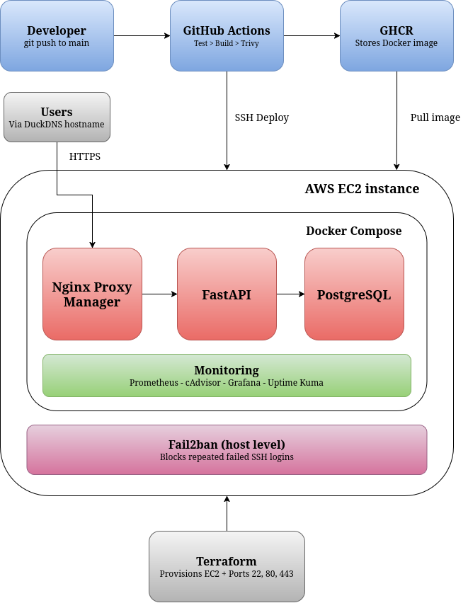
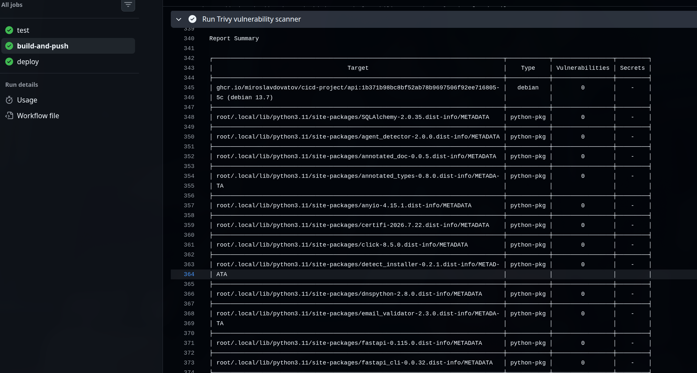
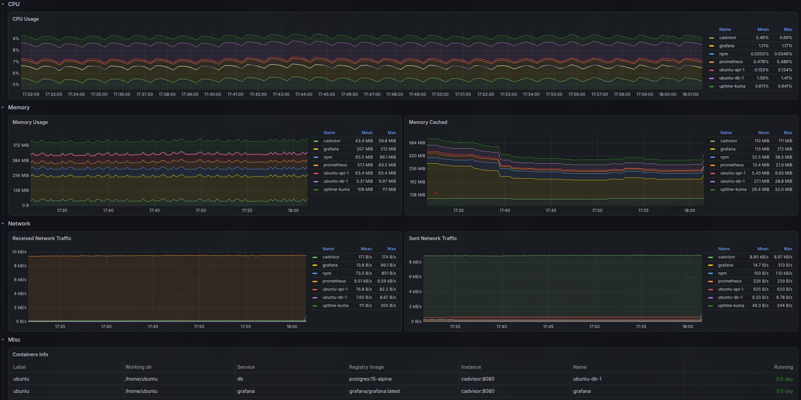
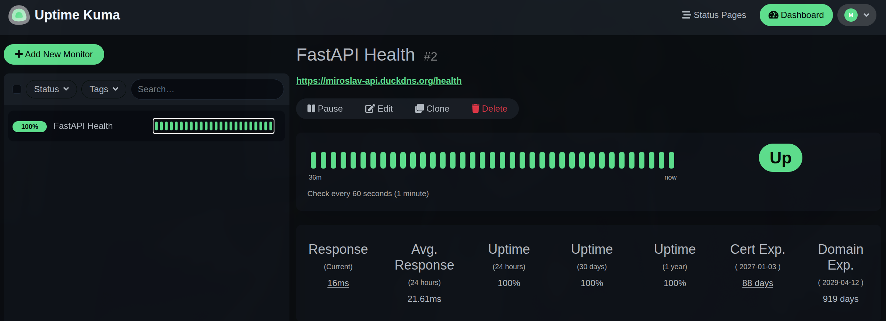

# FastAPI Cloud Infrastructure & DevSecOps Pipeline

A containerized FastAPI application deployed to AWS with Terraform, GitHub Actions, and a full monitoring stack. A push to `main` runs the tests, builds and publishes a Docker image, scans it, and deploys it to an EC2 instance automatically.

**Stack:** FastAPI, PostgreSQL, Docker Compose, Terraform, AWS EC2, GitHub Actions, Trivy, GHCR, Nginx Proxy Manager, DuckDNS, Let's Encrypt, Fail2ban, Prometheus, cAdvisor, Grafana, Uptime Kuma

## Architecture



The setup has three parts:

- **Developer and CI/CD:** GitHub and GitHub Actions handle testing, image building, scanning, and deployment.
- **AWS infrastructure:** Terraform provisions the EC2 instance, which runs the application stack with Docker Compose.
- **Observability:** Prometheus, cAdvisor, Grafana, and Uptime Kuma monitor the application and its containers.

Terraform manages the cloud infrastructure and GitHub Actions manages application delivery, so the app can be redeployed without touching the infrastructure.

## Features

- FastAPI REST API with Swagger docs and Prometheus metrics
- PostgreSQL for persistent storage
- AWS infrastructure defined in Terraform
- Three-job CI/CD pipeline with GitHub Actions
- Pytest tests run against a real PostgreSQL database
- Trivy vulnerability scanning of the published image
- Automatic deployment to EC2 over SSH
- Nginx Proxy Manager reverse proxy with Let's Encrypt HTTPS and a DuckDNS hostname
- Fail2ban protection against SSH brute-force attacks
- Container metrics and uptime monitoring

## Application Stack

Docker Compose runs everything on the EC2 instance: FastAPI, PostgreSQL, Nginx Proxy Manager, Prometheus, cAdvisor, Grafana, and Uptime Kuma. PostgreSQL, Grafana, Uptime Kuma, and Nginx Proxy Manager (including its certificates) keep their data in named Docker volumes.

**FastAPI** is the backend, written in Python 3.11 with SQLAlchemy. The Docker image uses a multi-stage build on `python:3.11-slim`. The endpoints are:

```text
GET   /health    database connectivity check
GET   /api/data  sample query against PostgreSQL
GET   /notes     list saved notes
POST  /notes     save a note
GET   /metrics   Prometheus metrics
GET   /docs      Swagger UI
```

**PostgreSQL** runs from the `postgres:15-alpine` image. FastAPI connects to it over the private Docker network.

## Infrastructure

**Terraform** defines the AWS resources in `main.tf`: the EC2 instance, a key pair, a security group, and an Elastic IP. The infrastructure can be recreated or changed from code without using the AWS console. State is stored locally and kept out of Git.

**EC2** is a `t3.small` Ubuntu 24.04 instance in `eu-central-1` with a 20 GB gp3 disk. A startup script installs Docker, including the Compose plugin, on first boot.

**Security groups** are also defined in Terraform. These inbound ports are open:

```text
22    SSH
80    HTTP
81    Nginx Proxy Manager admin
443   HTTPS
3000  Grafana
3001  Uptime Kuma
8000  FastAPI (direct access)
```

PostgreSQL, Prometheus, and cAdvisor publish ports on the host in `docker-compose.yml`, but have no inbound rule, so they are not reachable from the internet.

## CI/CD Pipeline

The GitHub Actions workflow has three jobs. Tests also run on pull requests to `main`, but the build and deploy jobs only run on pushes to `main`.

```text
Test -> Build, Push, Scan -> Deploy
```



### 1. Test

Pytest runs against a temporary PostgreSQL container started on the GitHub Actions runner. Using a real database means the tests cover the database integration as well as the application code. If this job fails, nothing is published or deployed.

### 2. Build, push, and scan

The image is built and pushed to GHCR with two tags: `latest`, and the commit SHA so each build can be traced back to its commit.

Trivy, an open-source vulnerability scanner from Aqua Security, then scans the published image rather than just the repository, so it covers the base image, OS packages, and Python dependencies. Only CRITICAL and HIGH findings that have a fix available are reported.

Trivy runs in audit mode (`exit-code: 0`). Findings show up in the workflow logs but do not fail the pipeline.

### 3. Deploy

The last job copies `docker-compose.yml` and `prometheus.yml` to the instance with SCP, then connects over SSH, logs Docker in to GHCR, removes unused Docker data, pulls the new image, and recreates the containers:

```bash
docker compose up -d --remove-orphans
```

## Ingress and Host Security

```text
Internet -> Nginx Proxy Manager (HTTPS :443) -> FastAPI (:8000) -> PostgreSQL
```

**Nginx Proxy Manager** is the main public entry point. It serves HTTPS on port 443 and forwards requests to FastAPI over the internal Docker network.

**DuckDNS** points the hostname `miroslav-api.duckdns.org` at the instance's Elastic IP, so the app has a stable address.

**Let's Encrypt** certificates are managed by Nginx Proxy Manager, so the API is served over HTTPS at `https://miroslav-api.duckdns.org` with a trusted certificate.

**Fail2ban** runs on the EC2 host, watches the authentication logs, and blocks IP addresses with repeated failed SSH logins. It is not part of the Terraform or Compose setup and was installed manually over SSH. Port 22 is open to all addresses, so this adds basic brute-force protection.

## Monitoring

- **Prometheus** scrapes the FastAPI `/metrics` endpoint and cAdvisor every 15 seconds and stores the results as time-series data, so there is history instead of only a live view.
- **cAdvisor** collects container CPU, memory, disk I/O, and network metrics and exposes them to Prometheus.
- **Grafana** builds dashboards on top of Prometheus to track container health and resource use.
- **Uptime Kuma** checks the public app's `/health` endpoint, which also tests the database connection, and records uptime, latency, and status history. This makes it easy to confirm the app is reachable after a deployment.





## Prerequisites

- A GitHub repository with access to GitHub Container Registry
- An AWS account with credentials configured for Terraform
- Terraform 1.5 or newer
- An SSH key pair (Terraform reads the public key from `~/.ssh/aws_ec2_key.pub`)
- A DuckDNS hostname
- Two GitHub Actions secrets: `EC2_HOST` (the instance address) and `EC2_SSH_KEY` (the private key)

## Deployment

**1. Provision the infrastructure**

```bash
terraform init
terraform plan
terraform apply
```

Terraform prints the Elastic IP as `server_public_ip`. Use it for your DuckDNS hostname and for SSH.

**2. Deploy the application**

Once the instance has finished its first boot and Docker is installed, push to `main` and the workflow does the rest:

```bash
git add .
git commit -m "Update application"
git push origin main
```

After the first deployment, a few things are set up by hand through each tool's web interface: the Nginx Proxy Manager proxy host and certificate (admin panel on port 81), the Grafana data source and dashboards, and the Uptime Kuma monitor.

## Challenges and Fixes

**Prometheus crashed on the first deployments.** The error was "Are you trying to mount a directory onto a file?". The pipeline ran `docker compose up -d` before `prometheus.yml` had been copied to the server. When the source of a bind mount is missing, Docker creates an empty directory in its place, and a directory cannot be mounted over a file. I added the SCP step so both files are copied before Compose runs, and deleted the empty directory on the host by hand.

**The API container crashed on startup.** `docker logs` showed a SQLAlchemy `ArgumentError`. `DATABASE_URL` was not reaching the production container, so `create_engine` received `None`. I gave `main.py` a fallback to a local SQLite file, `os.getenv("DATABASE_URL", "sqlite:///./app.db")`, and the variable is now set in `docker-compose.yml`. The tradeoff is that a missing variable no longer fails loudly.

**The server ran out of disk.** Repeated deployments left old images and stopped containers on the disk until it filled up, which blocked new deployments and SSH. The deploy job now runs `docker system prune -af` before pulling, and `--remove-orphans` removes containers for services that are no longer in the Compose file. Prune leaves named volumes alone.

**Data disappeared on every deploy.** Redeploying recreated the containers, which wiped PostgreSQL and the Nginx Proxy Manager configuration. Named Docker volumes (listed under Application Stack) fixed that, so data now survives redeploys. The volumes live on the instance's disk, so they are not a backup.

**The public IP changed whenever the instance was stopped or re-created.** The DuckDNS hostname then pointed at an address that no longer reached the server. I added an Elastic IP (`aws_eip`) in Terraform, so the address now stays the same when the instance is stopped and started.

## Project Goals

I built this to get hands-on experience with AWS, Terraform, Docker, CI/CD, container security scanning, reverse proxies and HTTPS, Linux server administration, and monitoring. The goal was a production-style pipeline from Git push to monitored AWS deployment with as little manual work as possible.